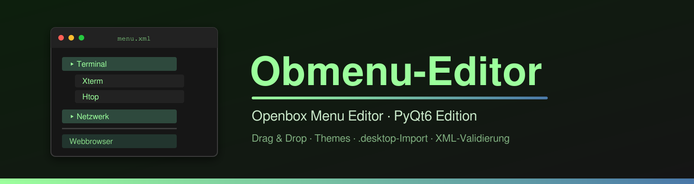
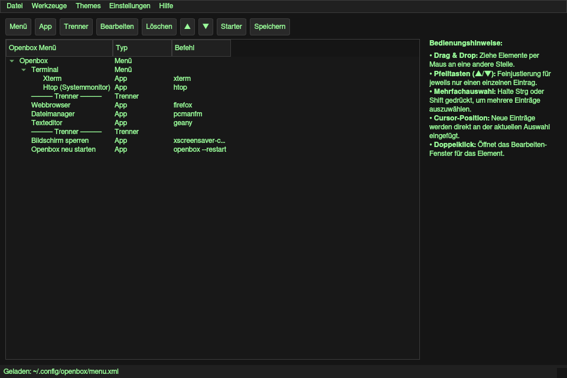

<p align="center">
  
</p>

<h1 align="center">Obmenu-Editor</h1>

<p align="center">
  <a href="https://github.com/cvinz78/obmenu-editor/blob/main/LICENSE"></a>
  
  
  
  
</p>

<p align="center">
  <a href="#deutsch">🇩🇪 Deutsch</a> ·
  <a href="#english">🇬🇧 English</a>
</p>

<p align="center">
  
</p>

---

## Deutsch

### Was ist der Obmenu-Editor?

**Obmenu-Editor** ist ein grafischer Menü-Editor für den [Openbox](http://openbox.org/) Window Manager unter Linux. Mit ihm lassen sich die `menu.xml` von Openbox bequem per Drag & Drop erstellen, bearbeiten und sortieren – ganz ohne manuelles XML-Editing. Er ist die moderne PyQt6-Neuauflage des klassischen Obmenu-Editors.

### Funktionen

- **Menüs, Apps & Trenner verwalten** – Neue Untermenüs, Anwendungseinträge und Trennlinien werden exakt an der aktuellen Cursor-Position (Markierung) eingefügt.
- **Drag & Drop** – Elemente per Maus frei verschieben, auch mehrfach verschachtelt. Mehrfachauswahl mit `Strg` + Klick oder `Shift` + Klick.
- **Feinjustierung** – Mit den ▲/▼-Buttons einzelne Einträge gezielt eine Position hoch- oder runterschieben.
- **.desktop-Import** – Starter-Dateien (z. B. aus `/usr/share/applications`) importieren; Name, Befehl und Icon werden automatisch übernommen.
- **Icons** – Icons für Menüs und Apps setzen; fehlende Icon-Pfade werden automatisch in den üblichen Icon-Verzeichnissen (`~/.local/share/icons`, `/usr/share/icons`, `/usr/share/pixmaps`, …) gesucht.
- **Bearbeiten-Dialog** – Doppelklick auf einen Eintrag öffnet den Dialog zum Bearbeiten von Name, Befehl und Icon.
- **XML-Validierung** – Prüfung der `menu.xml` auf Gültigkeit (über `xmllint`).
- **Openbox neu laden** – Nach dem Speichern wird `openbox --reconfigure` ausgeführt, damit die Änderungen sofort wirksam sind.
- **Automatisches Backup** – Beim Anlegen eines neuen Menüs wird eine vorhandene `menu.xml` als `menu.xml.bak` gesichert.
- **3 Themes** – Creamy, Darkmode und BlueMoon, jederzeit umschaltbar.
- **Zweisprachig** – Oberfläche auf Deutsch (DE) oder Englisch (EN) umschaltbar.
- **Einstellungen speichern** – Theme, Sprache, Fenstergröße und Menüpfad werden dauerhaft in `~/.config/obmenu-editor/settings.ini` gespeichert.
- **Hilfe & Über-Dialog** – eingebaute Anleitung (wird als `hilfe.txt` im Konfigurationsordner abgelegt) und Info-Fenster.

### Voraussetzungen

| Paket | Zweck |
|---|---|
| Python 3 | Laufzeitumgebung |
| PyQt6 | Grafische Oberfläche |
| `xmllint` (libxml2) | XML-Validierung (Werkzeuge-Menü) |
| Openbox | Window Manager, dessen Menü bearbeitet wird |

**Arch Linux:**

```bash
sudo pacman -S --needed base-devel libxml2 python
```

### Ausführen (aus dem Quellcode)

```bash
git clone https://github.com/cvinz78/obmenu-editor.git
cd obmenu-editor

python -m venv nuitka-env
source nuitka-env/bin/activate
pip install PyQt6

python menu.py
```

> **Hinweis:** Der Editor lädt standardmäßig `~/.config/openbox/menu.xml`. Existiert diese Datei, wird sie automatisch geöffnet; andernfalls startet der Editor mit einem leeren Menü. Über *Datei → Öffnen…* lässt sich jede beliebige `menu.xml` laden.

### Bauen der eigenständigen Binärdatei (Nuitka)

Der Editor lässt sich mit [Nuitka](https://nuitka.net/) in eine einzelne, eigenständige ausführbare Datei kompilieren – ganz ohne Python-Installation auf dem Zielsystem.

**1. Abhängigkeiten installieren (Arch Linux):**

```bash
sudo pacman -S --needed base-devel libxml2 ccache
```

> `ccache` ist optional, beschleunigt aber erneute Builds deutlich, da Nuitka es automatisch erkennt.

**2. Virtuelle Umgebung anrichten und Abhängigkeiten installieren:**

```bash
python -m venv nuitka-env
./nuitka-env/bin/pip install --upgrade pip
./nuitka-env/bin/pip install PyQt6 nuitka
```

**3. Kompilieren:**

```bash
./nuitka-env/bin/python -m nuitka --onefile --enable-plugin=pyqt6 --output-filename=obmenu menu.py
```

**4. Warten.** Je nach System dauert der Vorgang einige Minuten. Danach liegt die eigenständige Binärdatei `obmenu` direkt im Projektordner.

> Während des Builds können Warnungen wie `Nuitka-Scons:WARNING: You are not using ccache …` erscheinen. Diese sind harmlos – mit installiertem `ccache` (siehe Schritt 1) verschwinden sie und Folge-Builds werden schneller.

### Installation der Binärdatei

```bash
chmod +x obmenu
sudo install -Dm755 obmenu /usr/local/bin/obmenu
```

Optional: Ein Eintrag im Anwendungsmenü (`obmenu-editor.desktop` in diesem Repo) kann nach `~/.local/share/applications/` kopiert werden.

### Menü in Openbox aktivieren

Die Datei `~/.config/openbox/menu.xml` wird von Openbox standardmäßig verwendet. Falls nicht, in `~/.config/openbox/rc.xml` Folgendes prüfen:

```xml
<menu>
  <file>menu.xml</file>
</menu>
```

### Lizenz

Dieses Projekt ist unter der **GNU General Public License v3.0** lizenziert – siehe [LICENSE](LICENSE).

Copyright (C) 2026 [cvinz78](https://github.com/cvinz78)

---

## English

### What is the Obmenu-Editor?

**Obmenu-Editor** is a graphical menu editor for the [Openbox](http://openbox.org/) window manager on Linux. It lets you create, edit and rearrange Openbox's `menu.xml` comfortably via drag & drop – no manual XML editing required. It is the modern PyQt6 edition of the classic Obmenu editor.

### Features

- **Manage menus, apps & separators** – New sub-menus, application entries and separator lines are inserted exactly at the current cursor position (selection).
- **Drag & Drop** – Move items freely with the mouse, including nested moves. Multi-select via `Ctrl` + click or `Shift` + click.
- **Fine-tuning** – Use the ▲/▼ buttons to nudge a single selected item up or down one position.
- **.desktop import** – Import launcher files (e.g. from `/usr/share/applications`); name, command and icon are picked up automatically.
- **Icons** – Assign icons to menus and apps; missing icon paths are resolved automatically in the usual icon directories (`~/.local/share/icons`, `/usr/share/icons`, `/usr/share/pixmaps`, …).
- **Edit dialog** – Double-click any entry to edit its name, command and icon.
- **XML validation** – Checks the `menu.xml` for validity (via `xmllint`).
- **Reload Openbox** – After saving, `openbox --reconfigure` is run so changes apply immediately.
- **Automatic backup** – When creating a new menu, an existing `menu.xml` is backed up as `menu.xml.bak`.
- **3 themes** – Creamy, Darkmode and BlueMoon, switchable at any time.
- **Bilingual** – Switch the UI between German (DE) and English (EN).
- **Persistent settings** – Theme, language, window size and menu path are stored in `~/.config/obmenu-editor/settings.ini`.
- **Help & About dialogs** – Built-in manual (stored as `hilfe.txt` in the config folder) and info window.

### Requirements

| Package | Purpose |
|---|---|
| Python 3 | Runtime |
| PyQt6 | Graphical interface |
| `xmllint` (libxml2) | XML validation (Tools menu) |
| Openbox | Window manager whose menu you edit |

**Arch Linux:**

```bash
sudo pacman -S --needed base-devel libxml2 python
```

### Running (from source)

```bash
git clone https://github.com/cvinz78/obmenu-editor.git
cd obmenu-editor

python -m venv nuitka-env
source nuitka-env/bin/activate
pip install PyQt6

python menu.py
```

> **Note:** The editor loads `~/.config/openbox/menu.xml` by default. If that file exists it opens automatically; otherwise the editor starts with an empty menu. Use *File → Open…* to load any `menu.xml`.

### Building the standalone binary (Nuitka)

The editor can be compiled with [Nuitka](https://nuitka.net/) into a single standalone executable – no Python installation required on the target machine.

**1. Install dependencies (Arch Linux):**

```bash
sudo pacman -S --needed base-devel libxml2 ccache
```

> `ccache` is optional but speeds up rebuilds significantly, since Nuitka picks it up automatically.

**2. Set up a virtual environment and install dependencies:**

```bash
python -m venv nuitka-env
./nuitka-env/bin/pip install --upgrade pip
./nuitka-env/bin/pip install PyQt6 nuitka
```

**3. Compile:**

```bash
./nuitka-env/bin/python -m nuitka --onefile --enable-plugin=pyqt6 --output-filename=obmenu menu.py
```

**4. Wait.** Depending on your system this takes a few minutes. The standalone binary `obmenu` is then placed directly in the project folder.

> During the build you may see warnings such as `Nuitka-Scons:WARNING: You are not using ccache …`. They are harmless – with `ccache` installed (see step 1) they disappear and subsequent builds get faster.

### Installing the binary

```bash
chmod +x obmenu
sudo install -Dm755 obmenu /usr/local/bin/obmenu
```

Optionally, copy the desktop entry (`obmenu-editor.desktop` from this repo) to `~/.local/share/applications/` to get a launcher in your application menu.

### Enabling the menu in Openbox

Openbox uses `~/.config/openbox/menu.xml` by default. If it does not, check `~/.config/openbox/rc.xml`:

```xml
<menu>
  <file>menu.xml</file>
</menu>
```

### License

This project is licensed under the **GNU General Public License v3.0** – see [LICENSE](LICENSE).

Copyright (C) 2026 [cvinz78](https://github.com/cvinz78)
